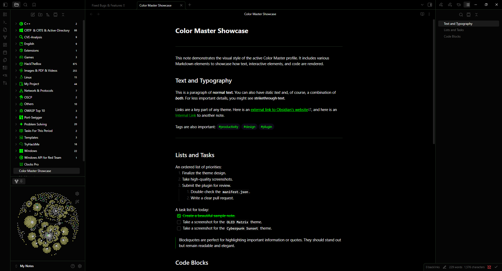

# Color Master for Obsidian

Take full control of your Obsidian theme with **Color Master**. This plugin provides a comprehensive user interface to edit every core CSS color variable in Obsidian. Create, save, and share your own color schemes with a powerful profile manager, all without needing to write a single line of CSS.

---

## Features

* **Live Color Editor**: A simple and intuitive UI with color pickers to see your changes instantly.
* **Profile Management**: Create, delete, and switch between multiple color profiles. Perfect for changing themes based on your mood or project.
* **Import & Export**: Easily share your favorite profiles with others or back them up. Just export to a `.json` file and import on another device.
* **Bilingual Interface**: Full support for both English and Arabic (العربية). The UI automatically adapts to Right-to-Left (RTL) mode.
* **Beautiful Default Themes**: Comes with four stunning, ready-to-use profiles to get you started.

---

## Included Profiles

The plugin comes with these hand-crafted profiles by default:

1.  **Default**: The standard Obsidian dark theme variables.
2.  **OLED Matrix**: A true-black, high-contrast theme with vibrant green accents, perfect for OLED screens.
3.  **Solarized Nebula**: A calm, low-contrast theme based on the popular "Solarized" palette, great for focus and long writing sessions.
4.  **CyberPunk**: A stylish dark theme with neon purple and pink highlights for a futuristic vibe.

---

## Profile Showcase

| OLED Matrix | Solarized Nebula |
| :---: | :---: |
| A true-black theme with vibrant green accents. | A calm theme based on the "Solarized" palette. |
|  |  |

| Cyberpunk Sunset | Default |
| :---: | :---: |
| A stylish dark theme with neon highlights. | The standard Obsidian dark theme variables. |
|  |  |

---

## Installation

1.  Download the latest release from the [GitHub Releases page](https://github.com/yazanammar/obsidian-color-master/releases).
2.  Extract the `color-master` folder into your vault's plugins folder: `<YourVault>/.obsidian/plugins/`.
3.  In Obsidian, go to `Settings` -> `Community plugins`.
4.  Enable the "Color Master" plugin.
5.  Open the plugin settings to start customizing!
