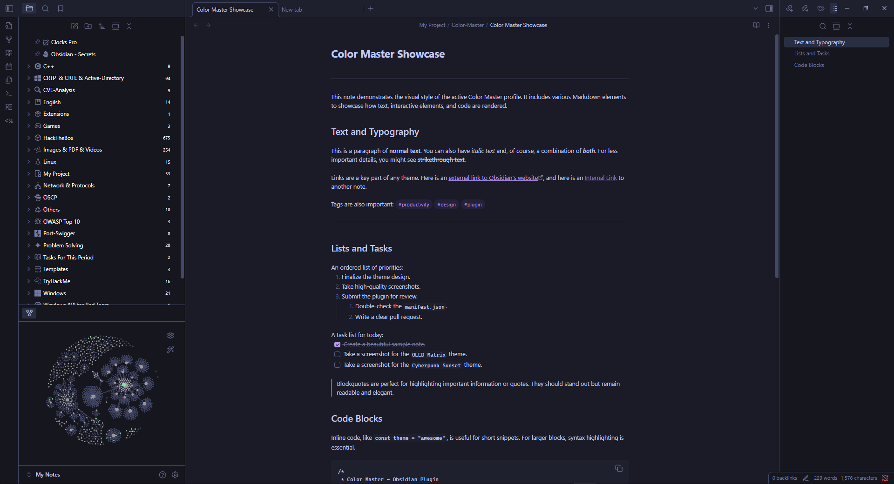

# Color Master for Obsidian

[](https://opensource.org/licenses/MIT) [](https://github.com/YazanAmmar/obsidian-color-master/releases)

Take full control of your Obsidian theme with **Color Master**. This plugin provides a comprehensive user interface to edit every core CSS color variable in Obsidian. Create, save, and share your own color schemes with a powerful profile manager, or even paste raw CSS to instantly use any theme you want—all without writing a single line of code.


---

## ✨ Features

Color Master is packed with features designed for both beginners and power-users, giving you ultimate control over your workspace's appearance.

#### 🏛️ Foundational Features
* **Live Color Editor**: An intuitive UI with color pickers and text inputs to see your changes instantly.
* **Full Profile Management**: Create, delete, and switch between multiple color profiles. Each profile is a self-contained unit that holds its own colors, snippets, notice rules, and theme settings.
* **Bilingual & RTL Ready**: Full support for English and Arabic (العربية), with a foundational architecture built to handle Right-to-Left layouts perfectly.
* **Beautiful Default Themes**: Comes with five stunning, ready-to-use profiles to get you started.

#### 🚀 Power-User Tools
* **NEW - Advanced Notice Coloring**: A revolutionary system to control the background and text color of pop-up notices based on their content (keywords or Regex). These rules are now saved **per-profile** and are included in exports!
* **Per-Profile CSS Snippets**: Snippets are no longer global and are now saved directly to the active profile. This means your small CSS tweaks are perfectly organized and are **exported automatically** with your theme.
* **Powerful Import/Export**:
    * **Create New Profile from JSON**: Easily import a `.json` file to create a brand new profile instantly.
    * **Smarter Import**: If you import a profile with a name that already exists, a new dialog will prompt you for a different name, preventing accidental overwrites.
* **Reliable Profile Snapshots**: Safely experiment with your colors! The **Pin** button now saves a complete snapshot of your profile, including **colors, CSS, snippets, and notice rules**.
* **Multi-Step Color Undo**: The "Undo" button (`reset` icon) remembers the last 5 changes you made to each color.
* **Profile-Specific Themes**: Force Obsidian into **Dark Mode** or **Light Mode** automatically when you activate a specific profile.

#### workflow & UI
* **NEW - Deep Search & Highlighting**: The search bar is now more powerful than ever, searching through variable **descriptions** (not just names) and highlighting matches with a beautiful animated gradient.
* **Full CSS Editing**: Create and **edit** your CSS-based profiles and snippets at any time.
* **Eraser Tool**: A handy **Eraser (`eraser`) button** has been added to every color picker to instantly set any color to `transparent`.
* **Workflow Hotkeys**: Assign hotkeys to toggle the plugin on/off or instantly cycle to your next profile.
* **Performance Control (FPS Slider)**: Adjust the live preview frame rate to ensure a smooth experience.
* **Plugin Integrations**: Full color control for the **Iconize** plugin, with an automated cleanup system.

---

## Included Profiles

The plugin comes with these hand-crafted profiles by default:

1.  **OLED Matrix**: A true-black, high-contrast theme with vibrant green accents.
2.  **Citrus Zest**: A brilliant light theme with a clean design and stunning orange highlights.
3.  **Solarized Nebula**: A calm, low-contrast theme based on the popular "Solarized" palette.
4.  **Cyberpunk Sunset**: A stylish dark theme with neon purple and pink highlights.
5.  **Default**: The standard Obsidian dark theme variables.

---

## Theme Previews

### 1. OLED Matrix


### 2. Citrus Zest


### 3. Solarized Nebula


### 4. Cyberpunk Sunset


### 5. Default


---

## Color Variable Reference

For advanced users who want to know exactly what they're changing, here is a complete list of the CSS variables controlled by this plugin and their descriptions.

<details>
<summary><strong>🎨 Click to expand the full list of variables</strong></summary>

| Variable | Description |
|---|---|
| **Plugin Integrations** | |
| `--iconize-icon-color` | Sets the color for all icons added by the Iconize plugin, overriding its native color settings. |
| **Backgrounds** | |
| `--background-primary` | Main background color for the entire app, especially for editor and note panes. |
| `--background-primary-alt` | An alternate background color, often used for the active line in the editor. |
| `--background-secondary` | Secondary background, typically used for sidebars and other UI panels. |
| `--background-secondary-alt`| An alternate secondary background, used for the file explorer's active file. |
| `--background-modifier-border`| The color of borders on various UI elements like buttons and inputs. |
| `--background-modifier-border-hover`| The border color when you hover over an element. |
| `--background-modifier-border-focus`| The border color for a focused element, like a selected text field. |
| `--background-modifier-flair`| Background color for special UI elements, like the 'Syncing' or 'Indexing' status. |
| `--background-modifier-hover` | The background color of elements when you hover over them (e.g., list items). |
| `--background-modifier-active`| The background color of an element when it's actively being clicked or is selected. |
| **Text** | |
| `--text-normal` | The default text color for all notes and most of the UI. |
| `--text-muted` | A slightly faded text color, used for less important information like file metadata. |
| `--text-faint` | The most faded text color, for very subtle UI text or disabled elements. |
| `--text-on-accent` | Text color that appears on top of accented backgrounds (like on a primary button). |
| `--text-accent` | The primary accent color for text, used for links and highlighted UI elements. |
| `--text-accent-hover` | The color of accent text (like links) when you hover over it. |
| `--text-selection` | The background color of text that you have selected with your cursor. |
| **Headings** | |
| `--h1-color` | The color of H1 heading text. |
| `--h2-color` | The color of H2 heading text. |
| `--h3-color` | The color of H3 heading text. |
| `--h4-color` | The color of H4 heading text. |
| `--h5-color` | The color of H5 heading text. |
| `--h6-color` | The color of H6 heading text. |
| **Markdown Elements** | |
| `--hr-color` | The color of the horizontal rule line created with `---`. |
| `--blockquote-border-color` | The color of the vertical border on the left side of a blockquote. |
| `--blockquote-color` | The text color for content inside of a blockquote. |
| `--blockquote-bg` | The background color for content inside of a blockquote. |
| `--tag-color` | Sets the text color of #tags. |
| `--tag-color-hover` | Sets the text color of #tags when hovering over them. |
| `--tag-bg` | Sets the background color of #tags, allowing for a 'pill' shape. |
| `--checklist-done-color` | The color of the checkmark and text for a completed to-do item. |
| `--code-normal` | Sets the text color inside inline code (between backticks). |
| `--code-background` | Sets the background color for inline code blocks. |
| `--text-highlight-bg` | Sets the background color for highlighted text (`==like this==`). |
| **Notices** | |
| `--cm-notice-bg-default` | Sets the default background color for all notices, unless overridden by a rule. |
| `--cm-notice-text-default` | Sets the default text color for all notices, unless overridden by a rule. |
| **Interactive Elements** | |
| `--interactive-normal` | The background color for interactive elements like buttons. |
| `--interactive-hover` | The background color for interactive elements when hovered. |
| `--interactive-accent` | The accent color for important interactive elements (e.g., the 'Create' button). |
| `--interactive-accent-hover`| The accent color for important interactive elements when hovered. |
| `--interactive-success` | Color indicating a successful operation (e.g., green). |
| `--interactive-error` | Color indicating an error (e.g., red). |
| `--interactive-warning` | Color indicating a warning (e.g., yellow). |
| **UI Elements** | |
| `--titlebar-background` | The background color of the main window's title bar. |
| `--titlebar-background-focused`| The title bar background color when the window is active. |
| `--titlebar-text-color` | The text color in the title bar. |
| `--sidebar-background` | Specifically targets the background of the sidebars. |
| `--sidebar-border-color` | The color of the border next to the sidebars. |
| `--header-background` | The background for headers within panes (e.g., note title header). |
| `--header-border-color` | The border color below pane headers. |
| `--vault-name-color` | The color of your vault's name in the top-left corner. |
| **Graph View** | |
| `--graph-line` | The color of the connection lines between notes in the Graph View. |
| `--graph-node` | The color of the circular nodes for existing notes. |
| `--graph-text` | The color of the text labels on the graph nodes. |
| `--graph-node-unresolved` | The color of nodes for notes that do not exist yet (unresolved links). |
| `--graph-node-focused` | Color of the node that is focused or hovered (highlighted node). |
| `--graph-node-tag`| Color of nodes representing tags when tags are shown in the graph. |
| `--graph-node-attachment` | Color of nodes representing attachments (e.g., image or other linked files). |
| **Misc** | |
| `--scrollbar-thumb-bg` | The color of the draggable part of the scrollbar. |
| `--scrollbar-bg` | The color of the scrollbar track (the background). |
| `--divider-color` | The color for general UI separator lines. |

</details>

---

## 🛠️ Building from Source

If you want to customize the plugin or contribute to its development, you can easily build it from the source code.

1.  **Clone the Repository:**
    ```bash
    git clone [https://github.com/YazanAmmar/obsidian-color-master.git](https://github.com/YazanAmmar/obsidian-color-master.git)
    cd obsidian-color-master
    ```

2.  **Install Dependencies:**
    Make sure you have Node.js installed. Then, run the following command in the project's root directory. This will download all necessary development libraries like `esbuild` and `sortablejs`.
    ```bash
    npm install
    ```

3.  **Build the Plugin:**
    To compile the TypeScript code and package the plugin for Obsidian, run the build command:
    ```bash
    npm run build
    ```

4.  **Load into Obsidian:**
    The compiled plugin files (`main.js`, `styles.css`, `manifest.json`) will be available in the project's root directory. Copy these files into your Obsidian vault's plugin folder: `<YourVault>/.obsidian/plugins/color-master/`.

---

## Installation

1.  Download the latest release from the [GitHub Releases page](https://github.com/YazanAmmar/obsidian-color-master/releases).
2.  Extract the plugin folder into your vault's plugins folder: `<YourVault>/.obsidian/plugins/`.
3.  In Obsidian, go to `Settings` -> `Community plugins`.
4.  Enable the "Color Master" plugin.
5.  Open the plugin settings to start customizing!
