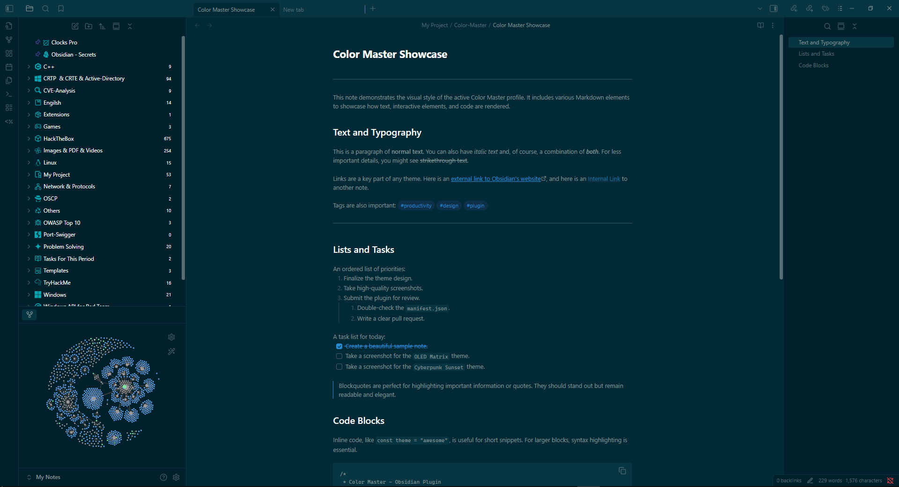

# Obsidian Color Master

[](https://opensource.org/licenses/MIT)
[](https://github.com/YazanAmmar/obsidian-color-master/releases)
[](https://github.com/YazanAmmar/obsidian-color-master/releases)
[](https://github.com/YazanAmmar/obsidian-color-master/blob/main/src/i18n.ts)
[](https://github.com/YazanAmmar/obsidian-color-master/stargazers)
[](https://github.com/YazanAmmar/obsidian-color-master/issues)

**Take full control of your Obsidian colors.**
Color Master exposes every core Obsidian CSS color variable (and your own custom ones) through a polished UI. Manage profiles, snippets, and even video backgrounds—no CSS knowledge required, but perfect for power users.

<p align="center">
  
</p>

## Table of Contents

- [Overview](#overview)
- [Why Color Master?](#why-color-master)
- [Features](#features)
- [Project Structure](#project-structure)
- [Supported Languages](#supported-languages)
- [Included Profiles](#included-profiles)
- [Screenshots / Demos](#screenshots--demos)
- [Color Variable Reference](#color-variable-reference)
- [Installation (End User)](#installation-end-user)
- [Building from Source (Developer)](#building-from-source-developer)
- [Usage Guide & Examples](#usage-guide--examples)
    - [1. Profiles: Create, Import, Export](#1-profiles-create-import-export)
    - [2. Setting a Custom Background (Image/Video)](#2-setting-a-custom-background-imagevideo)
    - [3. Using CSS Snippets (Profile & Global)](#3-using-css-snippets-profile--global)
    - [4. Advanced Notice Coloring](#4-advanced-notice-coloring-keywords--regex)
- [Hotkeys (Commands)](#hotkeys-commands)
- [Performance & Tips](#performance--tips)
- [Changelog (Summary)](#changelog-summary)
- [Roadmap](#roadmap)
- [Contributing](#contributing)
- [Troubleshooting / FAQ](#troubleshooting--faq)
- [License](#license)
- [Contact / Links](#contact--links)

---

## Overview

Color Master is an Obsidian plugin that allows you to edit and manage _all_ of Obsidian’s core CSS color variables using an interactive UI. Create theme **profiles** (bundles of colors, snippets, notice rules, and settings), switch between them instantly, export/share them as JSON, or even import CSS from your installed themes to create new, editable profiles.

Designed for both:

- **Beginners** — Simple color pickers, preset profiles, and a "Set Background" feature to get a polished look fast.
- **Power users / Developers** — Full variable list, per-profile & global snippets, drag-and-drop reordering, regex notice rules, and exportable JSON.

> The entire plugin is built on TypeScript, ensuring a stable, bug-free experience and faster future updates.

---

## Why Color Master?

- **Centralize Control:** Unify theme tweaks into **Profiles** (collections of variables + snippets + backgrounds).
- **No More CSS Sprawl:** Keep small CSS hacks tied to specific profiles instead of managing dozens of separate `.css` files.
- **Shareable Themes:** Create shareable theme packages (profiles export to a single `.json` file).
- **Automate Your Workspace:**
    - Force Dark/Light mode automatically per profile.
    - Apply custom video or image backgrounds per profile.
- **Intelligent & Dynamic:**
    - Style notice boxes by content (keyword / regex).
    - Get warned if an external theme might be interfering with your profile.
- **Performance Tuned:** Use the Live Preview FPS slider to balance visual feedback with CPU usage on your machine.

---

## Features

### 1. Core Profile Management

- **Live Color Editor**: An intuitive UI with color pickers and text inputs for over 60 core Obsidian variables.
- **Full Profile Management**: Create, delete, rename, and switch between multiple color profiles.
- **Import / Export**:
    - **Export to JSON**: Save your complete profile (colors, snippets, rules, background path) to a single `.json` file.
    - **Import from JSON**: Import a profile JSON. The UI lets you choose a new name, preventing accidental overwrites.
- **Beautiful Default Themes**: Comes with 5 stunning, ready-to-use profiles to get you started.

### 2. Advanced Customization

- **NEW - Per-Profile Backgrounds (Image & Video!)** [v1.1.1]:
    - Set a custom **image or video** background for each profile.
    - Built-in **Background Browser** to manage all your media: select, rename, and safely delete.
    - Easily add new media via file upload, drag & drop, or pasting a URL.
    - Automatically applies necessary transparency to UI elements for you.
    - Dedicated settings for **video (opacity, mute)** and **images (JPG conversion/quality)**.
- **Import from Installed Themes**:
    - Instantly create a new, editable CSS-based profile by importing the code from your already-installed community themes or snippets.
- **Advanced Notice Coloring**:
    - Control the background and text color of pop-up notices based on their content (keywords or Regex).
    - Rules are saved **per-profile** and are included in exports.
- **CSS Snippets (Profile & Global)**:
    - **Per-Profile Snippets**: Attach CSS snippets that are *only* active when their profile is active. Included in exports.
    - **Global Snippets**: Create snippets that stay active across *all* of your profiles, perfect for a custom font or a small, universal UI tweak.
    - **Drag & Drop**: Easily reorder your snippets with drag & drop to manage CSS priority (cascade).

### 3. Workflow & UI

- **NEW - Quick Theme Toggle**: Instantly cycle the active profile's theme setting between "Force Light," "Force Dark," and "Auto" with a new icon in the profile manager.
- **NEW - Ribbon Icon**: Access the Color Master settings with a single click from the Obsidian ribbon.
- **NEW - Reset Plugin**: A safe "Reset All Data" button in the advanced settings to restore the plugin to its factory state.
- **NEW - Theme Interference Warning**: A small ⚠️ icon appears if you have a community theme enabled, warning you that it might override your Color Master settings.
- **Add Custom CSS Variables**:
    - Add any CSS variable (e.g., from another plugin) to the UI.
    - Define its type (color, size, text, number) for the correct UI controls.
    - Custom variables are saved and exported with your profile.
- **Reliable Profile Snapshots**: Use the **Pin** button to save a complete snapshot of your profile (colors, CSS, snippets, rules). Experiment freely and restore with one click.
- **Multi-Step Color Undo**: The "Undo" icon (`reset`) remembers the last 5 changes you made to each specific color.
- **Plugin Integrations**: Full color control for the **Iconize** plugin, with an automated cleanup system.
- **Bilingual & RTL Ready**: Full support for English, Arabic, French, and Persian, with a robust architecture for Right-to-Left (RTL) layouts.

---

## Project Structure

Here is the corrected high-level structure of the `src` folder:

```markdown
src/
├── main.ts               # Main plugin class (entry point, onload/onunload)
├── constants.ts          # Default variables and built-in profiles
├── types.ts              # Core TypeScript type definitions (PluginSettings, Profile, Snippet)
├── utils.ts              # Helper functions (flattenVars, getContrastRatio)
├── commands/
│   └── index.ts          # Registers all commands for hotkeys
├── i18n/
│   ├── strings.ts        # Translation strings and logic
│   └── types.ts          # TypeScript type definitions for i18n
└── ui/
    ├── settingsTab.ts    # Builds the main settings UI container
    ├── modals.ts         # Contains all modal (popup) classes
    └── components/       # UI components drawn into the settingsTab
        ├── color-pickers.ts
        ├── profile-manager.ts
        ├── snippets-ui.ts
        ├── import-export.ts
        ├── options-section.ts
        └── like-plugin-card.ts
````

---

## Supported Languages

Color Master is designed to be accessible to a global audience with full support for the following languages:

- **English** (Default)
    
- **العربية (Arabic)** - Full RTL Support
    
- **Français (French)**
    
- **فارسی (Persian)** - Full RTL Support
    

The architecture is built to easily handle Right-to-Left (RTL) layouts.

---

## Included Profiles

The plugin comes with these hand-crafted profiles by default:

1. **Default**: The standard Obsidian dark theme variables.
    
2. **OLED Matrix**: A true-black, high-contrast theme with vibrant green accents.
    
3. **Citrus Zest**: A brilliant light theme with a clean design and stunning orange highlights.
    
4. **Solarized Nebula**: A calm, low-contrast theme based on the popular "Solarized" palette.
    
5. **CyberPunk**: A stylish dark theme with neon purple and pink highlights (based on Cyberpunk Sunset).
    

---

## Screenshots / Demos
### Default Themes

|**OLED Matrix**|**Citrus Zest (Light)**|
|---|---|
|||
|**Solarized Nebula**|**Cyberpunk Sunset**|
|||

---

## Color Variable Reference

The plugin provides a UI to edit **all 62** core CSS variables. Here is a quick reference for the most common ones (first 15, excluding headings):

|**Variable**|**Purpose**|
|---|---|
|`--background-primary`|Main editor / pane background|
|`--background-secondary`|Sidebar / panel backgrounds|
|`--text-normal`|Main text color|
|`--text-muted`|Secondary / muted text|
|`--text-accent`|Accent color (links, highlights)|
|`--text-on-accent`|Text color that appears on accent backgrounds|
|`--tag-color` / `--tag-bg`|Tag text and background pill color|
|`--blockquote-bg`|Blockquote background color|
|`--code-normal` / `--code-background`|Inline code text / background|
|`--interactive-normal`|Button background|
|`--interactive-accent`|Primary button background|
|`--graph-line`|Graph view line color|
|`--graph-node`|Graph view node color|
|`--cm-notice-bg-default`|Default notice background|
|`--iconize-icon-color`|Color for 'Iconize' plugin icons|

<details>

<summary><strong>🎨 Click to expand the full list of 62 core variables</strong></summary>

|**Variable**|**Description**|
|---|---|
|**Plugin Integrations**||
|`--iconize-icon-color`|Sets the color for all icons added by the Iconize plugin.|
|**Backgrounds**||
|`--background-primary`|Main background color for the entire app.|
|`--background-primary-alt`|An alternate background color (e.g., active line).|
|`--background-secondary`|Secondary background (sidebars, UI panels).|
|`--background-secondary-alt`|Alternate secondary background (e.g., active file).|
|`--background-modifier-border`|Color of borders on buttons and inputs.|
|`--background-modifier-border-hover`|Border color on hover.|
|`--background-modifier-border-focus`|Border color on focus.|
|`--background-modifier-flair`|Background for special UI (e.g., 'Syncing').|
|`--background-modifier-hover`|Background color of elements on hover.|
|`--background-modifier-active`|Background of elements when clicked/selected.|
|**Text**||
|`--text-normal`|The default text color for all notes.|
|`--text-muted`|Slightly faded text (e.g., file metadata).|
|`--text-faint`|The most faded text (disabled elements).|
|`--text-on-accent`|Text color that appears on top of accented backgrounds.|
|`--text-accent`|Primary accent color for text (links).|
|`--text-accent-hover`|Color of accent text (links) on hover.|
|`--text-selection`|The background color of selected text.|
|`--h1-color`|The color of H1 heading text.|
|`--h2-color`|The color of H2 heading text.|
|`--h3-color`|The color of H3 heading text.|
|`--h4-color`|The color of H4 heading text.|
|`--h5-color`|The color of H5 heading text.|
|`--h6-color`|The color of H6 heading text.|
|**Markdown Elements**||
|`--hr-color`|The color of the horizontal rule line (`---`).|
|`--blockquote-border-color`|The color of the vertical border on a blockquote.|
|`--blockquote-color`|The text color for content inside a blockquote.|
|`--blockquote-bg`|Sets the background color of blockquote elements.|
|`--tag-color`|Sets the text color of #tags.|
|`--tag-color-hover`|Sets the text color of #tags when hovering.|
|`--tag-bg`|Sets the background color of #tags (the 'pill').|
|`--checklist-done-color`|The color of the checkmark and text for a completed item.|
|`--code-normal`|Sets the text color inside inline code.|
|`--code-background`|Sets the background color for inline code blocks.|
|`--text-highlight-bg`|Background for highlighted text (`==like this==`).|
|**Notices**||
|`--cm-notice-bg-default`|Default background for notices (overridden by rules).|
|`--cm-notice-text-default`|Default text color for notices (overridden by rules).|
|**Interactive Elements**||
|`--interactive-normal`|Background for interactive elements (buttons).|
|`--interactive-hover`|Background for interactive elements on hover.|
|`--interactive-accent`|Accent color for important buttons (e.g., 'Create').|
|`--interactive-accent-hover`|Accent color for important buttons on hover.|
|`--interactive-success`|Color indicating a successful operation (green).|
|`--interactive-error`|Color indicating an error (red).|
|`--interactive-warning`|Color indicating a warning (yellow).|
|**UI Elements**||
|`--titlebar-background`|The background color of the main window's title bar.|
|`--titlebar-background-focused`|The title bar background color when the window is active.|
|`--titlebar-text-color`|The text color in the title bar.|
|`--sidebar-background`|Specifically targets the background of the sidebars.|
|`--sidebar-border-color`|The color of the border next to the sidebars.|
|`--header-background`|The background for headers within panes (note title).|
|`--header-border-color`|The border color below pane headers.|
|`--vault-name-color`|The color of your vault's name in the top-left corner.|
|**Graph View**||
|`--graph-line`|The color of the connection lines in the Graph View.|
|`--graph-node`|The color of the circular nodes for existing notes.|
|`--graph-text`|The color of the text labels on the graph nodes.|
|`--graph-node-unresolved`|The color of nodes for notes that do not exist yet.|
|`--graph-node-focused`|Color of the node that is focused or hovered.|
|`--graph-node-tag`|Color of nodes representing tags in the graph.|
|`--graph-node-attachment`|Color of nodes representing attachments.|
|**Misc**||
|`--scrollbar-thumb-bg`|The color of the draggable part of the scrollbar.|
|`--scrollbar-bg`|The color of the scrollbar track (the background).|
|`--divider-color`|The color for general UI separator lines.|

</details>

---

## Installation (End User)

1. Download the latest release from the [GitHub Releases page](https://github.com/YazanAmmar/obsidian-color-master/releases).
    
2. Extract the plugin folder into your vault's plugins folder: `<YourVault>/.obsidian/plugins/`.
    
3. In Obsidian, go to `Settings` -> `Community plugins`.
    
4. Enable the "Color Master" plugin.
    
5. Open the plugin settings to start customizing!
    

---

## Building from Source (Developer)

If you want to customize the plugin or contribute to its development, you can easily build it from the source code.

1. **Clone the Repository:**
    
    
    
```Bash
git clone https://github.com/YazanAmmar/obsidian-color-master.git
cd obsidian-color-master
```
    
2. Install Dependencies:
    
    Make sure you have Node.js installed. Then, run the following command.
    
    ```Bash
    npm install
    ```
    
3. **Build the Plugin:** To compile the TypeScript code and package the plugin for Obsidian:
    
    - **Standard Build:** Use `npm run build` to compile the core files (`main.js`, `styles.css`, `manifest.json`) into the project root.
        
        ```Bash
        npm run build
        ```
        
    - **Development Build (Advanced):** Use `npm run dev` to **compile AND automatically copy** the resulting files to a local Obsidian vault.
        
        ```Bash
        npm run dev
        ```
        
> [!NOTE]
> 
> The npm run dev command is currently configured with a personal path:
> 
> C:\Users\user\Documents\Obsidian\My Notes\.obsidian\plugins\obsidian-color-master
> 
> You must edit the dev script inside the package.json file to point to your local vault's plugin folder before running this command.
        
4. Load into Obsidian: The compiled files (main.js, styles.css, manifest.json) will be in the project's root. Copy these files into your vault's plugin folder:
    
```bash
    <YourVault>/.obsidian/plugins/color-master/
```

---

## Usage Guide & Examples

### 1. Profiles: Create, Import, Export

A **Profile** is a single "theme" that saves all your settings.

- **Create**: Go to `Profile Manager` -> `New`. Give it a name and choose if it should force "Dark", "Light" mode or "Auto".
    
- **Export**: Select the profile you want to share, then click `Export File`. This saves a single `.json` file with all colors, snippets, and rules.
    
- **Import**: Click `Import / Paste (.json)`. You can paste the JSON text or upload the file. You will be prompted to give it a new name.
    
### 2. Setting a Custom Background (Image/Video)

This is one of the most popular features [from v1.1.0].

1. Go to `Advanced Settings` -> `Set Custom Background`.
    
2. Click the `+` (Add) button. A modal will open.
    
3. **Drag & drop** an image or video, **upload** a file, or **paste a URL**.
    
4. The plugin will save the media and activate it.
    
5. Click the `📦` (Browse) button to see all your saved media, rename them, or select a different one.
    
6. Click the `⚙️` (Settings) button to control video opacity, mute, or image quality.
    

### 3. Using CSS Snippets (Profile & Global)

You can add small CSS tweaks without creating separate files.

- **Profile Snippets**: Created normally. They are tied to the active profile and are exported with it.
    
- **Global Snippets**: When creating/editing a snippet, check the "Save as Global Snippet" toggle. This snippet will remain active _no matter which profile you switch to_.
    
- **Order**: You can **drag and drop** snippets in the list to control their load order (snippets lower in the list can override ones above them).
    

### 4. Advanced Notice Coloring (Keywords & Regex)

Customize the color of pop-up notices based on their text content.

1. Find the `Notices` category in the color pickers.
    
2. Click the `⚙️` (Settings) icon next to `--cm-notice-bg-default` (for background) or `--cm-notice-text-default` (for text).
    
3. In the modal, click `Add New Rule`.
    
4. **Keywords**: Type keywords (e.g., "Success", "Saved") into the box and press `Space` or `Enter`.
    
5. **Regex**: Or, type a regular expression (e.g., `\bError\b`) and check the "Regex" box.
    
6. Choose a color for that rule.
    
7. You can drag and drop rules to change their priority. The first rule that matches (from top to bottom) will be applied.
    

---

## Hotkeys (Commands)

You can assign hotkeys to these commands in `Settings` -> `Hotkeys`:

- **Enable & Disable**: Toggle the entire plugin on or off.
    
- **Cycle to next profile**: Instantly switch to the next profile in your list.
    
- **Cycle to previous profile**: Switch to the previous profile.
    
- **Open settings tab**: Open the Color Master settings panel.
    
- **Cycle active profile theme**: Cycle the active profile's theme (Light/Dark/Auto).
    

---

## Performance & Tips

-   If you notice lag while dragging a color picker, reduce the **Live Update FPS** slider in the `Advanced Settings` section. A value of 0 disables live preview completely, applying color only when you release the mouse.
	
-   The **Theme Interference Warning** ⚠️ is important. If you have a community theme (e.g., "Minimal") enabled *and* a Color Master profile active, they might fight over colors. For best results, set your Obsidian theme to "Default" and let Color Master handle all the colors.
	
-   **For Optimal Performance:** We recommend enabling the **Convert images to JPG** option in the Background Settings. This automatically compresses uploaded images, resulting in smaller file sizes and better loading performance without noticeable loss of visual quality.
	
-   **If you encounter stability or performance issues:** First, export your current profiles and backgrounds. Then, use the **Reset Plugin Settings** option in Advanced Settings to restore the plugin to its factory state. This often solves underlying data conflicts.

---

## Changelog (Summary)

For full details, see [`CHANGELOG.md`](https://github.com/YazanAmmar/obsidian-color-master/blob/main/CHANGELOG.md).

- **v1.1.1** - Added **Per-Profile Video Background** support, enhanced settings display performance by **restoring scroll position**, and refactored the translation structure.
	
- **v1.1.0** - Added **Per-Profile Custom Backgrounds** (Image & Video), background browser, and media management tools.
    
- **v1.0.9** - Added **Import from Installed Themes/Snippets**, Quick Theme Toggle, Reset Plugin button, and Theme Interference Warning.
    
- **v1.0.8** - Added **Global CSS Snippets**, a Ribbon Icon, flexible RTL options, and new hotkeys.
    
- **v1.0.7** - The **TypeScript Rewrite**! Added Drag & Drop for snippets, "Add Custom Variable" feature, session-persistent undo for editors, and support for French & Persian.

---

## Roadmap

Here are the future plans for Color Master. Feel free to contribute or suggest features!

- [ ] **Community Profile Marketplace**: An easy way to browse, share, and import profiles from other users.
- [ ] **More Plugin Integrations**: Add dedicated color variables for other popular plugins (e.g., Kanban, Calendar).
- [ ] **AI-Powered Theming**: Integrate with Gemini or ChatGPT API to generate profiles and snippets, helping users build their dream theme.
- [ ] **Export as Full Theme (.zip)**: Allow exporting a complete profile (colors, snippets, settings, and base64 background) as a ready-to-publish Obsidian theme file.
- [ ] **Advanced Context Triggers**: Automatically activate profiles based on context (time of day, current folder, or note tags).
- [ ] **Advanced CSS Editor**: Upgrade the snippet editor with syntax highlighting, autocomplete for Obsidian variables, and live error detection (Linting).
- [ ] **Advanced Color Helpers**:
    - [ ] Live contrast ratio warnings (AA/AAA) directly in the color picker.
    - [ ] A "Suggest Accessible Color" button based on contrast algorithms.
- [ ] **Color Blindness Simulator**: Add an accessibility tool that applies an SVG filter to the UI to simulate various types of color blindness.
- [ ] **Expanded Core Variable Support**: Add support for more official Obsidian color variables as they are introduced.
- [ ] **Continuous Performance Optimizations**

---

## Contributing

Contributions are welcome!

1. Fork the repo.
    
2. Create a feature branch: `git checkout -b feat/your-feature`.
    
3. Run `npm install` and `npm run build` locally to ensure no errors.
    
4. Open a pull request with a clear description.
    
5. Update `CHANGELOG.md` and this `README.md` where relevant.

Please follow the existing code style, and ensure your contributions are **innovative and consistent with the plugin's vision**.

> [!TIP]
> **Are you a developer of another plugin?** If you'd like your plugin to be natively supported by Color Master (e.g., controlling a specific color variable of your UI), feel free to open a Pull Request. Supporting integration is a great way to gain more visibility for your work!

---
## Troubleshooting / FAQ

### Q: ⚠️ Why are my colors not changing after I activate a profile?

A: This is the most common issue. You likely have a **Community Theme** (like Minimal, Atom, etc.) enabled simultaneously. This external theme imposes its own color rules and interferes with the variables set by **Color Master**.

**The Best Solution:**

1. Go to Obsidian's **Settings** -> **Appearance** -> **Themes**.
    
2. Select the **Default** theme for Obsidian.
    
3. The ⚠️ warning icon in Color Master settings will disappear, and your profile's colors will apply correctly.
    

**Advanced Solution (To customize an external theme):**

1. Set Obsidian's theme to **Default**.
    
2. Open **Color Master** settings and click **Import / Paste (.css)**.
    
3. Select the **"Import from installed theme"** option and choose the theme you want to modify (e.g., Minimal).
    
4. This creates a **new CSS Profile** within Color Master containing the external theme's code, allowing you to customize its colors safely without conflicts.
    

---

### Q: I added an image or video background, but the UI (like sidebars) is still dark. Why isn't it transparent?

A: **Color Master** uses **Smart Transparency** to handle this.

- When you activate a background, the plugin automatically sets key CSS variables (like `--background-primary` and `--sidebar-background`) to `transparent`.
    
- This makes the UI layers see-through, allowing your image or video to be visible.
    

---

### Q: What is the difference between a normal Snippet and a Global Snippet?

A: The core difference is scope:

- **Profile Snippet (Normal):** Is linked to a **single profile**. It only activates when that specific profile is active, and it is included when you export the profile.

>Use **Profile Snippets** for things that only make sense with that profile, like a special `h1` color.

- **Global Snippet:** **Always** remains active, regardless of which profile is currently selected. This is ideal for universal styles you always need, like a custom font or hiding a specific UI element.

>Use **Global Snippets** for things you _always_ want, like a custom font.

---

### Q: What are Snapshots (Pin) and why should I use them?

A: Snapshots are a safety feature.

- The **Pin** button saves an **instant snapshot** of the profile's current state (colors, CSS, and notice rules).
    
- If you make changes you don't like, the **Reset to Pinned** button instantly reverts the profile to the saved snapshot, allowing for risk-free experimentation.
    

---

### Q: 🌍 Does the plugin support Right-to-Left (RTL) languages?

A: Yes, absolutely. The plugin fully supports **Arabic** (العَرَبيَّةُ) and **Persian** (فارسی). You can find the **Enable Right-to-Left (RTL) Layout** setting near the language dropdown to flip the interface completely for a seamless reading experience.

---
## License

MIT — see [LICENSE](https://github.com/YazanAmmar/obsidian-color-master/blob/main/LICENSE).

---

## Contact / Links

- **GitHub Repo**: [https://github.com/YazanAmmar/obsidian-color-master](https://github.com/YazanAmmar/obsidian-color-master)
    
- **Issues & Features**: [GitHub Issues Page](https://github.com/YazanAmmar/obsidian-color-master/issues)
    
- **Telegram Channel**: [https://t.me/ObsidianColorMaster](https://t.me/ObsidianColorMaster)
    
